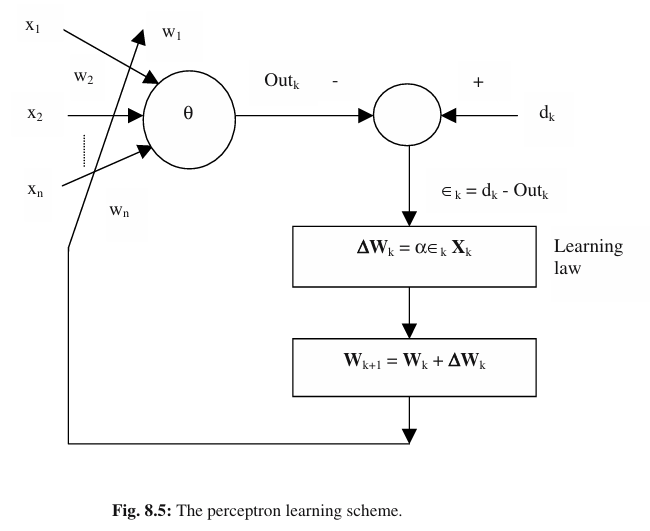
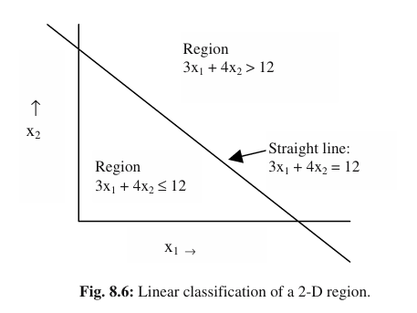
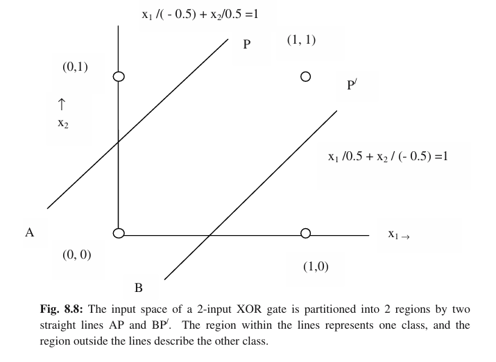

# Single-Layer Feedforward Neural Networks: The Perceptron

## Table of Contents
1.  [Introduction to Neural Networks](#1-introduction-to-neural-networks)
2.  [What is a Perceptron?](#2-what-is-a-perceptron)
3.  [Biological Inspiration](#3-biological-inspiration)
4.  [Perceptron Architecture](#4-perceptron-architecture)
    * [Inputs](#41-inputs)
    * [Weights](#42-weights)
    * [Bias](#43-bias)
    * [Weighted Sum](#44-weighted-sum)
    * [Activation Function](#45-activation-function)
    * [Output](#46-output)
5.  [The Perceptron Algorithm (Learning Rule)](#5-the-perceptron-algorithm-learning-rule)
    * [Initialization](#51-initialization)
    * [Training Steps](#52-training-steps)
    * [Weight Update Rule](#53-weight-update-rule)
    * [Learning Rate](#54-learning-rate)
6.  [Convergence and Limitations](#6-convergence-and-limitations)
    * [Convergence of the Perceptron Learning Algorithm](#61-Convergence)
    * [Linearly Separable Data](#62-linearly-separable-data)
    * [XOR Problem](#63-xor-problem)
7.  [Applications](#7-applications)
8.  [Further Reading](#8-further-reading)
9.  [See Also](#9-see-also)

---

## 1. Introduction to Neural Networks

Neural Networks are a subset of machine learning inspired by the structure and function of the human brain. They consist of interconnected "neurons" or "nodes" organized in layers. These networks are designed to recognize patterns, classify data, and make predictions by learning from data. The Perceptron is one of the earliest and simplest forms of a neural network.

## 2. What is a Perceptron?

The Perceptron is a supervised learning algorithm for binary classification. It was invented by Frank Rosenblatt in 1957. It's a single-layer feedforward neural network that can learn to classify data that is **linearly separable**. Despite its simplicity, it forms the foundational concept for understanding more complex neural networks.

## 3. Biological Inspiration

The Perceptron model is loosely inspired by the biological neuron. A biological neuron receives electrical signals (inputs) through dendrites, processes them in the cell body, and transmits an output signal through its axon. Similarly, a Perceptron receives numerical inputs, performs a computation, and produces a single output.

## 4. Perceptron Architecture

A single Perceptron unit consists of:

### 4.1. Inputs

Represented as a vector $X = [x_1, x_2, ..., x_n]$, these are the features of the input data. Each input feature $x_i$ is fed into the Perceptron.

### 4.2. Weights

Each input $x_i$ is associated with a weight $w_i$. Weights ($W = [w_1, w_2, ..., w_n]$) are parameters that the Perceptron learns during training. They determine the strength or importance of each input signal.

### 4.3. Bias

A bias term ($b$) is an additional input to the Perceptron with a constant value (often 1), multiplied by its own weight ($w_0$ or $b$). The bias allows the Perceptron to shift the activation function curve up or down, which is crucial for decision boundary placement. It essentially provides the model with more flexibility to fit the data.

### 4.4. Weighted Sum

The first step in a Perceptron's computation is to calculate the weighted sum of its inputs and the bias. This is often called the **net input** or **pre-activation value**.

$$
\text{net\_input} = \left( \sum_{i=1}^{n} w_i x_i \right) + b
$$

Alternatively, using dot product notation:

$$
\text{net\_input} = \mathbf{W} \cdot \mathbf{X} + b
$$

Where $W$ is the vector of weights and $X$ is the vector of inputs.

### 4.5. Activation Function

The weighted sum is then passed through an **activation function**. For the original Perceptron, a common choice is the **step function** (or Heaviside step function or sign function).

* **Step Function:**
    $$ f(z) = \begin{cases} 1 & \text{if } z \ge 0 \\ 0 & \text{if } z < 0 \end{cases} $$
    Or for a bipolar output (-1 or 1):
    $$ f(z) = \begin{cases} 1 & \text{if } z \ge 0 \\ -1 & \text{if } z < 0 \end{cases} $$
    Where $z$ is the `net_input`.

The activation function introduces non-linearity (though the Perceptron's overall decision boundary remains linear) and determines the Perceptron's output based on whether the `net_input` crosses a certain threshold.

### 4.6. Output

The output of the activation function is the Perceptron's prediction. For binary classification, it typically outputs 0 or 1 (or -1 or 1).

## 5. The Perceptron Algorithm (Learning Rule)

The Perceptron learns iteratively by adjusting its weights and bias based on the difference between its predicted output and the actual target output.

### 5.1. Initialization

* Initialize weights $W$ and bias $b$ to small random values or zeros.

### 5.2. Training Steps

The training process involves iterating through the training dataset multiple times (epochs). For each training example $(X_j, y_j)$:

1.  **Calculate the Net Input:**
    $$ z_j = W \cdot X_j + b $$

2.  **Calculate the Predicted Output:**
    $$ \hat{y}_j = f(z_j) $$
    where $f$ is the chosen activation function (e.g., step function).

3.  **Update Weights and Bias (if misclassified):**
    If the predicted output $\hat{y}_j$ does not match the actual target $y_j$, the weights and bias are updated.

### 5.3. Weight Update Rule

The core of the Perceptron learning rule is:

$$ w_i^{\text{new}} = w_i^{\text{old}} + \Delta w_i $$
$$ \Delta w_i = \eta (y_j - \hat{y}_j) x_{ji} $$

And for the bias:

$$ b^{\text{new}} = b^{\text{old}} + \Delta b $$
$$ \Delta b = \eta (y_j - \hat{y}_j) $$

Where:
* $\eta$ (eta) is the **learning rate**.
* $y_j$ is the true target output for the current training example.
* $\hat{y}_j$ is the predicted output from the Perceptron.
* $x_{ji}$ is the $i$-th input feature for the current training example.

**Explanation of Update:**
* If $\hat{y}_j = y_j$ (correct prediction), then $(y_j - \hat{y}_j) = 0$, and no weights are updated.
* If $\hat{y}_j = 0$ and $y_j = 1$ (predicted 0, should be 1): $(y_j - \hat{y}_j) = 1$. Weights $w_i$ associated with positive $x_{ji}$ values are increased, and weights associated with negative $x_{ji}$ values are decreased, effectively pushing the net input $z$ towards a positive value.
* If $\hat{y}_j = 1$ and $y_j = 0$ (predicted 1, should be 0): $(y_j - \hat{y}_j) = -1$. Weights $w_i$ associated with positive $x_{ji}$ values are decreased, and weights associated with negative $x_{ji}$ values are increased, pushing the net input $z$ towards a negative value.

### 5.4. Learning Rate ($\eta$)

The learning rate is a hyperparameter that controls how much the weights are adjusted with respect to the error each time.
* A small learning rate leads to slow convergence but can help avoid overshooting the optimal weights.
* A large learning rate can lead to faster convergence but might oscillate around the optimum or fail to converge at all.

## 6. Convergence and Limitations

## 6.1. Convergence

### 📘 Perceptron Convergence Proof

Let there be two classes $C_1$ and $C_2$, where $C_1$ and $C_2$ correspond to the training instances for which the output is 1 and 0 respectively.

Using the perceptron learning rule iteratively for $k = 0$ to $K$, we get:

#### Update Equations:

$$
\mathbf{W}_1 = \mathbf{W}_0 + \alpha \epsilon_0 \mathbf{X}_0 \tag{8.11}
$$

$$
\mathbf{W}_2 = \mathbf{W}_1 + \alpha \epsilon_1 \mathbf{X}_1 
= \mathbf{W}_0 + \alpha \epsilon_0 \mathbf{X}_0 + \alpha \epsilon_1 \mathbf{X}_1 \tag{8.12}
$$

$$
\mathbf{W}_{K+1} = \mathbf{W}_K + \alpha \epsilon_K \mathbf{X}_K + \ldots + \alpha \epsilon_0 \mathbf{X}_0 \tag{8.13}
$$

Assuming $\mathbf{W}_0 = 0$ and $\epsilon_0 = 0$, we have:

$$
\mathbf{W}_{K+1} = \sum_{j=1}^{K} \alpha \epsilon_j \mathbf{X}_j \tag{8.14}
$$

---

Let there be a weight vector $\mathbf{W}^*$ that can linearly separate the classes $C_1$ and $C_2$. Pre-multiplying both sides of the last expression by $\mathbf{W}^{*T}$, we get:

$$
\mathbf{W}^{*T} \mathbf{W}_{K+1} = \alpha \sum_{j=1}^{K} \epsilon_j \mathbf{W}^{*T} \mathbf{X}_j \tag{8.15}
$$

Since output vectors $\mathbf{X}_j$ are misclassified, $\epsilon_j \mathbf{W}^{*T} \mathbf{X}_j$ is strictly positive. Thus we define:

$$
a = \min_j \left( \epsilon_j \mathbf{W}^{*T} \mathbf{X}_j \right) \tag{8.16}
$$

So:

$$
\mathbf{W}^{*T} \mathbf{W}_{K+1} \geq K \cdot a \tag{8.17}
$$

By the [Cauchy–Schwarz inequality](w):

$$
\| \mathbf{W}_{K+1} \|^2 \geq \frac{(\mathbf{W}^{*T} \mathbf{W}_{K+1})^2}{\| \mathbf{W}^* \|^2} \tag{8.18}
$$

Combining with (8.17):

$$
\| \mathbf{W}_{K+1} \|^2 \geq \frac{(K \cdot a)^2}{\| \mathbf{W}^* \|^2} \tag{8.19}
$$

---

#### Bounding the Norm Growth

We square both sides of the update rule:

$$
\mathbf{W}_{j+1} = \mathbf{W}_j + \alpha \epsilon_j \mathbf{X}_j \Rightarrow 
\| \mathbf{W}_{j+1} \|^2 = \| \mathbf{W}_j \|^2 + \| \alpha \epsilon_j \mathbf{X}_j \|^2 + 2 \alpha \epsilon_j \mathbf{W}_j^T \mathbf{X}_j \tag{8.20}
$$

Define:

$$
Q = \max_j \| \alpha \epsilon_j \mathbf{X}_j \|^2 \tag{8.21}
$$

Since $\mathbf{X}_j$ is misclassified, $\epsilon_j \mathbf{W}_j^T \mathbf{X}_j < 0$. Thus:

$$
\| \mathbf{W}_{j+1} \|^2 \leq \| \mathbf{W}_j \|^2 + Q \tag{8.22}
$$

Adding this up from $j = 1$ to $K$:

$$
\| \mathbf{W}_{K+1} \|^2 \leq Q \cdot K \tag{8.23}
$$

---

#### Final Inequality and Convergence

Using (8.19) and (8.23):

$$
\frac{(K \cdot a)^2}{\| \mathbf{W}^* \|^2} \leq Q \cdot K \tag{8.24}
$$

Divide both sides by $Q \cdot K$:

$$
1 \leq \frac{(K \cdot a)^2}{Q \cdot K \cdot \| \mathbf{W}^* \|^2} \Rightarrow 
1 \leq \frac{K \cdot a^2}{Q \cdot \| \mathbf{W}^* \|^2} \Rightarrow 
K \leq \frac{Q \cdot \| \mathbf{W}^* \|^2}{a^2} \tag{8.26}
$$

---

#### ✅ Conclusion

* Since $K$ is bounded above, the Perceptron learning algorithm must **converge in a finite number of steps**.
* The bound on the number of misclassifications is:

$$
K_{\max} = \frac{Q \cdot \| \mathbf{W}^* \|^2}{a^2}
$$

This is the **Perceptron Convergence Theorem**, proving that if the data is linearly separable, the algorithm will find a solution in a finite number of updates.

### 6.2. Linearly Separable Data

The Perceptron Convergence Theorem states that if the training data is **linearly separable** (meaning a straight line, plane, or hyperplane can separate the classes), then the Perceptron algorithm is guaranteed to converge to a solution in a finite number of iterations.

### 6.3. XOR Problem

One of the most significant limitations of the single-layer Perceptron was highlighted by Marvin Minsky and Seymour Papert in their 1969 book "Perceptrons." They demonstrated that a single Perceptron cannot solve problems that are not linearly separable, such as the **Exclusive OR (XOR) problem**.

The XOR truth table:
| Input 1 ($x_1$) | Input 2 ($x_2$) | Output ($y$) |
|-----------------|-----------------|--------------|
| 0               | 0               | 0            |
| 0               | 1               | 1            |
| 1               | 0               | 1            |
| 1               | 1               | 0            |

It's impossible to draw a single straight line to separate the '0' outputs from the '1' outputs in a 2D plane for XOR. This limitation led to a period known as "AI Winter" for neural networks, until the development of multi-layer perceptrons and backpropagation addressed this issue.

## 7. Applications

Despite its limitations, the Perceptron found early applications in:
* Simple pattern recognition
* Optical character recognition (for single digits)
* Basic logic gates (AND, OR, NOT)

## 8. Further Reading

* **Original Paper:** Rosenblatt, F. (1958). The Perceptron: A Probabilistic Model for Information Storage and Organization in the Brain. *Psychological Review, 65*(6), 386–408.
* **Book:** Minsky, M. L., & Papert, S. A. (1969). *Perceptrons: An Introduction to Computational Geometry*. MIT Press.
* **Online Course:** Andrew Ng's Machine Learning Course (Coursera) - provides good intuition on neural networks.
* **Textbook:** "Deep Learning" by Ian Goodfellow, Yoshua Bengio, Aaron Courville (Chapter on Perceptrons).

## 9. See Also

* [Multi-Layer Perceptron (MLP)](../multi_layer_perceptron/mlp_theory.md)
* [Activation Functions (General)](../general_neural_network_concepts/activation_functions.md)

---

See the Python implementation of the Perceptron [here](perceptron_implementation.py).