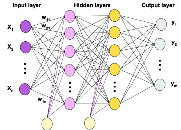

# Multi-Layer Perceptron (MLP)

## Table of Contents
1.  [Introduction](#1-introduction)
2.  [Beyond the Single Perceptron](#2-beyond-the-single-perceptron)
3.  [MLP Architecture](#3-mlp-architecture)
    * [Input Layer](#31-input-layer)
    * [Hidden Layers](#32-hidden-layers)
    * [Output Layer](#33-output-layer)
    * [Neurons (Nodes)](#34-neurons-nodes)
    * [Connections and Weights](#35-connections-and-weights)
    * [Activation Functions](#36-activation-functions)
4.  [How MLPs Solve Non-Linear Problems](#4-how-mlps-solve-non-linear-problems)
5.  [Training an MLP](#5-training-an-mlp)
    * [Forward Pass](#51-forward-pass)
    * [Loss Calculation](#52-loss-calculation)
    * [Backpropagation](#53-backpropagation)
    * [Weight Update](#54-weight-update)
6.  [Key Characteristics](#6-key-characteristics)
7.  [Applications](#7-applications)
8.  [See Also](#8-see-also)

---

## 1. Introduction

A Multi-Layer Perceptron (MLP) is a class of feedforward artificial neural networks. Unlike a single-layer perceptron, an MLP consists of at least three layers of nodes: an input layer, one or more hidden layers, and an output layer. MLPs are capable of learning complex non-linear relationships in data, making them a powerful tool for a wide range of machine learning tasks.

## 2. Beyond the Single Perceptron

The single-layer Perceptron, as discussed, is limited to solving only linearly separable problems (e.g., AND, OR gates). It famously failed at the XOR problem, which cannot be separated by a single straight line.

MLPs overcome this limitation by introducing **hidden layers** between the input and output layers. These hidden layers allow the network to learn and represent complex, non-linear mappings between inputs and outputs, effectively creating non-linear decision boundaries.

## 3. MLP Architecture

An MLP is typically structured as follows:

### 3.1. Input Layer

* The first layer of the network.
* Contains neurons that simply pass the input features ($x_1, x_2, ..., x_n$) to the next layer without any computation. The number of neurons in the input layer corresponds to the number of features in the input data.

### 3.2. Hidden Layers

* Layers positioned between the input and output layers.
* MLPs can have one or more hidden layers. The number of hidden layers and the number of neurons within each hidden layer are design choices (hyperparameters).
* Neurons in hidden layers perform weighted sums of their inputs from the previous layer and apply an activation function to produce an output, which then serves as input to the next layer.

### 3.3. Output Layer

* The final layer of the network.
* The number of neurons in the output layer depends on the type of problem being solved:
    * **Binary Classification:** Typically 1 neuron (e.g., for logistic regression output).
    * **Multi-class Classification:** Number of neurons equals the number of classes.
    * **Regression:** Typically 1 neuron (for predicting a continuous value).
* The output layer also applies an activation function, chosen based on the problem (e.g., sigmoid for binary classification, softmax for multi-class classification, linear for regression).

### 3.4. Neurons (Nodes)

* Each neuron (except input layer neurons) calculates a weighted sum of its inputs and applies an activation function.
    $$ \text{output} = f \left( \left( \sum_{i=1}^{n} w_i x_i \right) + b \right) $$
    Where $x_i$ are inputs from the previous layer, $w_i$ are corresponding weights, $b$ is the bias, and $f$ is the activation function.

### 3.5. Connections and Weights

* Neurons in one layer are fully connected to every neuron in the subsequent layer (feedforward fashion). There are no connections between neurons within the same layer, nor are there feedback connections (which would make it a recurrent neural network).
* Each connection has an associated weight ($w$), and each neuron (except input) has an associated bias ($b$). These weights and biases are the parameters that the MLP learns during training.

### 3.6. Activation Functions

* Non-linear activation functions (e.g., Sigmoid, Tanh, ReLU, Leaky ReLU) are crucial for hidden layers. Without non-linear activation functions, an MLP would simply be a stack of linear operations, effectively reducing it to a single linear model, regardless of the number of layers.
* The choice of activation function for the output layer depends on the problem type.

## 4. How MLPs Solve Non-Linear Problems

The introduction of hidden layers with non-linear activation functions allows MLPs to learn complex, non-linear relationships. Each hidden layer can be thought of as learning increasingly abstract representations of the input data. By combining these non-linear transformations, the MLP can form arbitrarily complex decision boundaries in the input space, thus solving problems like XOR that are not linearly separable.

## 5. Training an MLP

Training an MLP is typically done using supervised learning, involving an iterative process of:

### 5.1. Forward Pass

* Input data is fed into the network.
* Activations are computed from the input layer through each hidden layer to the output layer.

### 5.2. Loss Calculation

* The network's predicted output is compared to the true target output using a chosen loss function (e.g., Mean Squared Error for regression, Cross-Entropy for classification). This quantifies the error.

### 5.3. Backpropagation

* The core of MLP training. The error calculated in the output layer is propagated backward through the network.
* This process uses the chain rule of calculus to compute the gradient of the loss function with respect to every weight and bias in the network. Each neuron's contribution to the total error is determined.

### 5.4. Weight Update

* Using the calculated gradients, an optimization algorithm (typically a variant of Gradient Descent, like Adam, RMSprop, or Stochastic Gradient Descent) updates the weights and biases of the network to minimize the loss function.

These steps are repeated over many **epochs** (full passes through the dataset) and often in **mini-batches** to improve training stability and efficiency.

## 6. Key Characteristics

* **Feedforward:** Information flows in one direction, from input to output, without loops.
* **Fully Connected:** Each neuron in one layer is connected to all neurons in the next layer.
* **Non-linear Activation:** Crucial for learning complex patterns.
* **Supervised Learning:** Requires labeled data for training.

## 7. Applications

MLPs are versatile and have been applied to numerous problems, including:
* Image Classification
* Speech Recognition
* Natural Language Processing (as components in larger systems)
* Time Series Prediction
* Regression tasks
* Anomaly Detection

## 8. See Also

* [Perceptron](../01-Single_Layer_Feed_Forward_Networks/perceptron_theory.md)
* [Backpropagation Algorithm](../03-Backpropagation/backpropagation_theory.md)
* [Activation Functions (General)](../general_neural_network_concepts/activation_functions.md) (Coming Soon!)
* [Loss Functions](../general_neural_network_concepts/loss_functions.md) (Coming Soon!)

---

See the Python implementation of a Multi-Layer Perceptron [here](mlp_implementation.py).