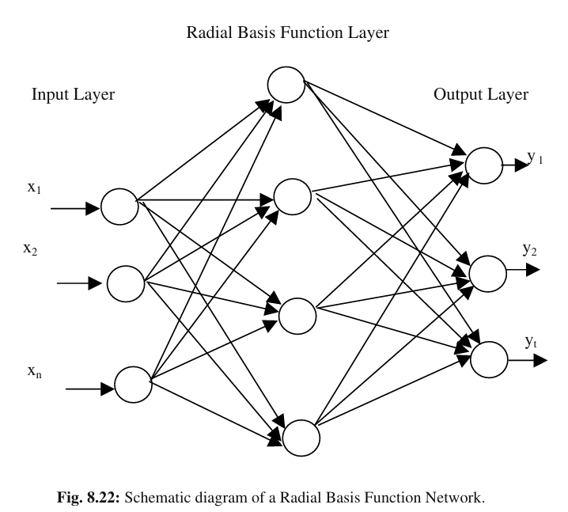

# Radial Basis Function Neural Networks (RBFNN)

## Table of Contents
1.  [Introduction](#1-introduction)
2.  [Motivation and Comparison to MLPs](#2-motivation-and-comparison-to-mlps)
3.  [RBFNN Architecture](#3-rbfnn-architecture)
    * [Input Layer](#31-input-layer)
    * [Hidden Layer (Radial Basis Functions)](#32-hidden-layer-radial-basis-functions)
    * [Output Layer](#33-output-layer)
4.  [Radial Basis Functions (RBFs)](#4-radial-basis-functions-rbfs)
    * [Gaussian RBF](#41-gaussian-rbf)
    * [Parameters: Center and Width](#42-parameters-center-and-width)
5.  [Training an RBFNN (Two-Stage Process)](#5-training-an-rbfnn-two-stage-process)
    * [Stage 1: Learning Hidden Layer Parameters](#51-stage-1-learning-hidden-layer-parameters)
    * [Stage 2: Learning Output Layer Weights](#52-stage-2-learning-output-layer-weights)
6.  [Advantages](#6-advantages)
7.  [Limitations](#7-limitations)
8.  [Applications](#8-applications)
9.  [See Also](#9-see-also)

---

## 1. Introduction

Radial Basis Function Neural Networks (RBFNNs) are a type of artificial neural network that use radial basis functions as their activation functions in the hidden layer. Unlike Multi-Layer Perceptrons (MLPs) which use sigmoidal or ReLU activations and typically learn through backpropagation across all layers, RBFNNs have a distinct, typically three-layer architecture and often employ a two-stage training process. They are particularly well-suited for function approximation, time series prediction, and classification tasks.

## 2. Motivation and Comparison to MLPs

* **Local vs. Global Activation:** While MLP hidden neurons use global activation functions (e.g., sigmoid), meaning their output changes significantly over a large range of input space, RBFNN hidden neurons use local activation functions (RBFs). This means an RBF neuron responds significantly only when the input is close to its "center."
* **Faster Training:** Due to their two-stage training process, RBFNNs can often be trained much faster than MLPs, especially for large datasets, as the second stage involves solving a linear system.
* **Interpolation/Approximation:** RBFNNs are strong universal approximators, meaning they can approximate any continuous function given enough hidden neurons.

## 3. RBFNN Architecture

A typical RBFNN consists of three layers:

### 3.1. Input Layer

* This layer consists of source nodes that connect the network to the environment.
* It simply passes the input feature vector $X = [x_1, x_2, ..., x_D]$ to the hidden layer without any computation. The number of input nodes equals the dimensionality of the input vector.

### 3.2. Hidden Layer (Radial Basis Functions)

* This is the most distinctive part of an RBFNN. Each neuron in this layer represents a **radial basis function**.
* Each hidden neuron has a **center** ($c_j$) and a **width** or **spread** ($\sigma_j$).
* When an input vector $X$ is presented, each hidden neuron calculates its output based on the **distance** between the input $X$ and its center $c_j$. This output is then transformed by the radial basis function (e.g., Gaussian).
    * The further the input is from the center, the smaller the output of the RBF neuron.
* The number of hidden neurons is a design parameter.

### 3.3. Output Layer

* This layer consists of a set of linear summing units.
* Each output neuron computes a weighted sum of the outputs from the hidden layer.
* For a single output neuron:
    $$ Y = \sum_{j=1}^{M} w_j \phi_j(X) $$
    Where $M$ is the number of hidden neurons, $\phi_j(X)$ is the output of the $j$-th RBF neuron, and $w_j$ are the linear weights connecting the $j$-th hidden neuron to the output neuron.
* No non-linear activation function is typically applied in the output layer for standard RBFNNs; it's a linear combination.

## 4. Radial Basis Functions (RBFs)

A radial basis function $\phi(X)$ is a real-valued function whose value depends only on the distance from the origin or some fixed point, called the center $c$. That is, $\phi(X) = \phi(||X - c||)$.

### 4.1. Gaussian RBF

The most commonly used radial basis function is the **Gaussian function**:

$$ \phi_j(X) = \exp \left( - \frac{||X - c_j||^2}{2 \sigma_j^2} \right) $$

Where:
* $X$ is the input vector.
* $c_j$ is the center of the $j$-th RBF neuron.
* $\sigma_j$ is the width (or spread) of the $j$-th RBF neuron.
* $||X - c_j||$ denotes the Euclidean distance between the input vector $X$ and the center vector $c_j$.

### 4.2. Parameters: Center and Width

The performance of an RBFNN heavily depends on the choice of its RBF centers and widths.
* **Centers ($c_j$):** Determine the location in the input space where the RBF neuron is maximally active.
* **Widths ($\sigma_j$):** Determine the "receptive field" or influence region of the RBF neuron. A smaller $\sigma$ means a narrower, more localized response; a larger $\sigma$ means a broader response.

## 5. Training an RBFNN (Two-Stage Process)

RBFNN training typically involves two distinct stages:

### 5.1. Stage 1: Learning Hidden Layer Parameters (Centers and Widths)

The goal of this stage is to determine the optimal centers ($c_j$) and widths ($\sigma_j$) for the hidden RBF neurons. This is often done using unsupervised learning methods or fixed strategies:

* **Random Selection:** Randomly choose training data points as centers.
* **Clustering Algorithms:** Use K-Means clustering on the input data to determine the centers. Each cluster centroid becomes a center $c_j$. Widths $\sigma_j$ can then be set based on the average distance to the nearest centers or points within the cluster.
* **Orthogonal Least Squares (OLS):** An incremental method to select centers one by one.
* **Gradient Descent:** Less common for this stage, but possible to fine-tune centers and widths.

### 5.2. Stage 2: Learning Output Layer Weights ($w_j$)

Once the hidden layer parameters (centers and widths) are fixed, the problem reduces to a linear regression problem. The goal is to find the optimal linear weights ($w_j$) that connect the hidden layer to the output layer.

* This is typically solved using **least squares methods** (e.g., pseudo-inverse, singular value decomposition).
* Given the outputs of the RBF neurons ($\Phi$) for all training inputs and the true targets ($Y_{true}$), we want to find weights $W$ such that $\Phi W \approx Y_{true}$.
    $$ W = (\Phi^T \Phi)^{-1} \Phi^T Y_{true} $$
    Where $\Phi$ is the matrix of hidden layer outputs for all training examples.
* This stage is computationally efficient because it involves solving a system of linear equations, not iterative gradient descent across multiple layers.

## 6. Advantages

* **Faster Training:** The two-stage training is often significantly faster than backpropagation in MLPs.
* **Good for Non-Linear Problems:** Excellent at function approximation and pattern classification.
* **Interpretability:** The localized nature of RBFs can sometimes offer more insight into how the network is making decisions compared to MLPs.
* **Universal Approximators:** Given enough hidden neurons, RBFNNs can approximate any continuous function.

## 7. Limitations

* **Curse of Dimensionality:** Performance can degrade in very high-dimensional input spaces as the number of hidden neurons needed to cover the space effectively grows exponentially.
* **Choice of Parameters:** Determining the optimal number of hidden neurons, their centers, and widths can be challenging and often requires heuristic methods or cross-validation.
* **Memory Usage:** Can be memory-intensive if many hidden neurons are required.

## 8. Applications

* Function Approximation
* Time Series Prediction
* Classification (e.g., pattern recognition, medical diagnosis)
* Control Systems
* Signal Processing

## 9. See Also

* [Multi-Layer Perceptron (MLP)](mlp_theory.md)
* [K-Means Clustering](../clustering/k_means_clustering.md) (Potential future topic folder, relevant for Stage 1 training)
* [Linear Regression](../supervised_learning/linear_regression.md) (Potential future topic folder, relevant for Stage 2 training)

---

See the Python implementation of an RBFNN [here](rbf-func_approx.py).