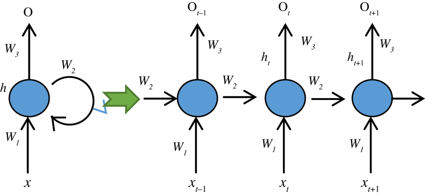

# Recurrent Neural Networks (RNNs)

## Table of Contents
1.  [Introduction](#1-introduction)
2.  [Why Recurrent Networks?](#2-why-recurrent-networks)
3.  [The Core Idea: Memory and Loops](#3-the-core-idea-memory-and-loops)
4.  [RNN Architecture](#4-rnn-architecture)
    * [Unrolled View](#41-unrolled-view)
    * [Recurrent Connection](#42-recurrent-connection)
    * [Hidden State (Memory)](#43-hidden-state-memory)
    * [Inputs, Outputs, Weights](#44-inputs-outputs-weights)
5.  [Forward Pass in RNN](#5-forward-pass-in-rnn)
    * [Equations](#51-equations)
6.  [Training RNNs: Backpropagation Through Time (BPTT)](#6-training-rnns-backpropagation-through-time-bptt)
7.  [Challenges with Standard RNNs](#7-challenges-with-standard-rnns)
    * [Vanishing Gradients](#71-vanishing-gradients)
    * [Exploding Gradients](#72-exploding-gradients)
    * [Short-Term Memory](#73-short-term-memory)
8.  [Types of RNN Architectures (Input/Output Mappings)](#8-types-of-rnn-architectures-inputoutput-mappings)
9.  [Applications of RNNs](#9-applications-of-rnns)
10. [See Also](#10-see-also)

---

## 1. Introduction

Recurrent Neural Networks (RNNs) are a class of artificial neural networks designed to process sequential data, where the order of information matters. Unlike feedforward neural networks (like MLPs) which assume that all inputs are independent, RNNs have "memory" of past inputs, making them suitable for tasks involving sequences such as natural language, speech, and time series.

## 2. Why Recurrent Networks?

Traditional feedforward networks like MLPs have several limitations when dealing with sequences:
* **Fixed Input Size:** They require a fixed-size input, which is impractical for variable-length sequences (e.g., sentences of different lengths).
* **No Memory:** They treat each input independently, failing to capture dependencies across time steps. For example, understanding a word in a sentence often requires context from previous words.
* **No Parameter Sharing:** Different parts of a sequence would require different weights, leading to a large number of parameters if modeled explicitly.

RNNs address these issues by introducing a hidden state that carries information from one step to the next, effectively giving the network a short-term memory.

## 3. The Core Idea: Memory and Loops

The distinguishing feature of an RNN is its internal loop. This loop allows information to persist, meaning the output at any given time step $t$ is not only influenced by the input at $t$ but also by the hidden state from the previous time step $t-1$.

## 4. RNN Architecture

An RNN neuron (or layer) takes two inputs:
1.  The current input from the sequence, $x_t$.
2.  The hidden state (or activation) from the previous time step, $h_{t-1}$.

It then computes a new hidden state $h_t$ and possibly an output $y_t$.

### 4.1. Unrolled View

While an RNN conceptually has a loop, it's often easier to understand by "unrolling" it over time. This shows the network as a deep feedforward network where each layer corresponds to a time step. The same weights are used across all time steps.

### 4.2. Recurrent Connection

The connection that feeds the hidden state from time $t-1$ back into the network at time $t$ is called the **recurrent connection**. This is where the "memory" comes from.

### 4.3. Hidden State (Memory)

The **hidden state** ($h_t$) at time $t$ serves as the network's memory. It encapsulates information about all the previous inputs in the sequence up to time $t$.

### 4.4. Inputs, Outputs, Weights

* **Inputs ($x_t$):** The input at the current time step.
* **Outputs ($y_t$):** The output at the current time step (optional; some RNNs only output at the end of a sequence).
* **Weights:**
    * $W_{xh}$: Weights connecting input $x_t$ to hidden state $h_t$.
    * $W_{hh}$: Weights connecting previous hidden state $h_{t-1}$ to current hidden state $h_t$ (these are the recurrent weights, shared across time steps).
    * $W_{hy}$: Weights connecting hidden state $h_t$ to output $y_t$.
    * $b_h$, $b_y$: Bias terms for hidden and output layers.

## 5. Forward Pass in RNN

At each time step $t$, the hidden state $h_t$ is computed based on the current input $x_t$ and the previous hidden state $h_{t-1}$. The output $y_t$ is then computed from $h_t$.

### 5.1. Equations

$$ h_t = f_h(W_{xh} x_t + W_{hh} h_{t-1} + b_h) $$
$$ y_t = f_y(W_{hy} h_t + b_y) $$

Where:
* $f_h$ is the activation function for the hidden layer (e.g., `tanh`, `ReLU`).
* $f_y$ is the activation function for the output layer (e.g., `softmax` for classification, linear for regression).

The initial hidden state $h_0$ is typically initialized to zero or small random values.

## 6. Training RNNs: Backpropagation Through Time (BPTT)

RNNs are trained using an algorithm called **Backpropagation Through Time (BPTT)**. It is an extension of the standard backpropagation algorithm adapted for recurrent networks.
1.  **Forward Pass:** The network computes activations for all time steps.
2.  **Calculate Loss:** The total loss is typically the sum of losses at each time step (or at the final time step, depending on the task).
3.  **Backward Pass (Backpropagation Through Time):** The error is backpropagated from the output layer back through the network, but crucially, it also flows backward through time, differentiating the error with respect to the recurrent weights at each time step.
4.  **Weight Update:** Gradients are accumulated over time steps, and then weights are updated based on these aggregated gradients.

Because the same weights ($W_{hh}$) are used at every time step, their gradients are summed up over all time steps where they were used.

## 7. Challenges with Standard RNNs

Despite their power, simple (vanilla) RNNs face significant challenges:

### 7.1. Vanishing Gradients

* During BPTT, gradients are repeatedly multiplied by the same recurrent weight matrix. If the values in this matrix (or the derivatives of the activation function) are small, gradients can shrink exponentially as they propagate backward through many time steps.
* This makes it difficult for the network to learn long-range dependencies, as updates to weights based on early inputs become negligible.

### 7.2. Exploding Gradients

* Conversely, if the values in the recurrent weight matrix or derivatives are large, gradients can grow exponentially, leading to very large weight updates that destabilize the network (e.g., weights becoming `NaN`).
* Exploding gradients are generally easier to detect and mitigate (e.g., using gradient clipping).

### 7.3. Short-Term Memory

* Due to the vanishing gradient problem, vanilla RNNs struggle to remember information for many time steps. They tend to give more weight to recent inputs, effectively having "short-term memory."
* This is a major limitation for tasks requiring context from distant past events.

These challenges led to the development of more sophisticated RNN architectures like LSTMs and GRUs.

## 8. Types of RNN Architectures (Input/Output Mappings)

RNNs can be configured for various sequence-to-sequence mappings:
* **One-to-One:** Standard Neural Network (e.g., image classification).
* **One-to-Many:** Image captioning (input: image, output: sequence of words).
* **Many-to-One:** Sentiment analysis (input: sequence of words, output: single sentiment score).
* **Many-to-Many (Sequence-to-Sequence):**
    * **Same length:** Machine translation (input: words in source language, output: words in target language).
    * **Different length:** Speech recognition (input: audio sequence, output: text sequence).

## 9. Applications of RNNs

RNNs are widely used in tasks involving sequential data:
* Natural Language Processing (NLP):
    * Machine Translation
    * Speech Recognition
    * Text Generation
    * Sentiment Analysis
* Time Series Forecasting (e.g., stock prices, weather)
* Video Analysis (e.g., activity recognition)
* Handwriting Recognition

## 10. See Also

* [Long Short-Term Memory (LSTM)](../lstm/lstm_theory.md) 
* [Gated Recurrent Unit (GRU)](../gru/gru_theory.md) 
* [Backpropagation Through Time (BPTT)](backpropagation_through_time.md)
* [Continuous Hopfield Network](continuous_hopfield_network_theory.md) 
* [Discrete Hopfield Network](discrete_hopfield_network_theory.md) 

---

See the Python implementation of a simple RNN [here](rnn.py).